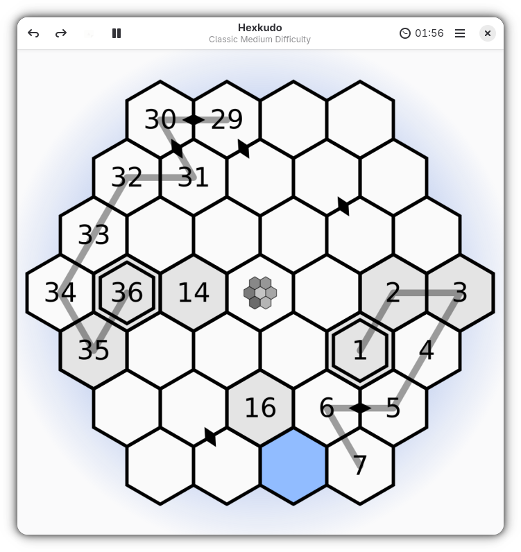

# Hexkudo - A Number-placement Logic Game

Hexkudo is a GNOME number-placement logic game.
Each puzzle gives you a grid of hexagons and a few numbers as anchor.
Your job is to connect them into a continuous path that visits every cell exactly once, in numeric order.
Hexkudo comes with a simple interface and several difficulty levels that makes it fun for players of all skill level.

Hexkudo is inspired by several projects including [GNOME Sudoku](https://gitlab.gnome.org/GNOME/gnome-sudoku) and [Open Sudoku](https://gitlab.com/opensudoku/opensudoku)

## Contributing to the Project

We welcome community contributions to this project.
If you find problems, then please open an [issue](https://github.com/herve4m/hexkudo/issues) or create a [pull request](https://github.com/herve4m/hexkudo/pulls).

More information about contributing can be found in the [Contribution Guidelines](https://github.com/herve4m/hexkudo/blob/main/CONTRIBUTING.md).

## Release Notes

See the [changelog](https://github.com/herve4m/hexkudo/blob/main/CHANGELOG.rst).

## Licensing

GNU General Public License v3.0 or later.

See [LICENSE](https://www.gnu.org/licenses/gpl-3.0.txt) to read the full text.
